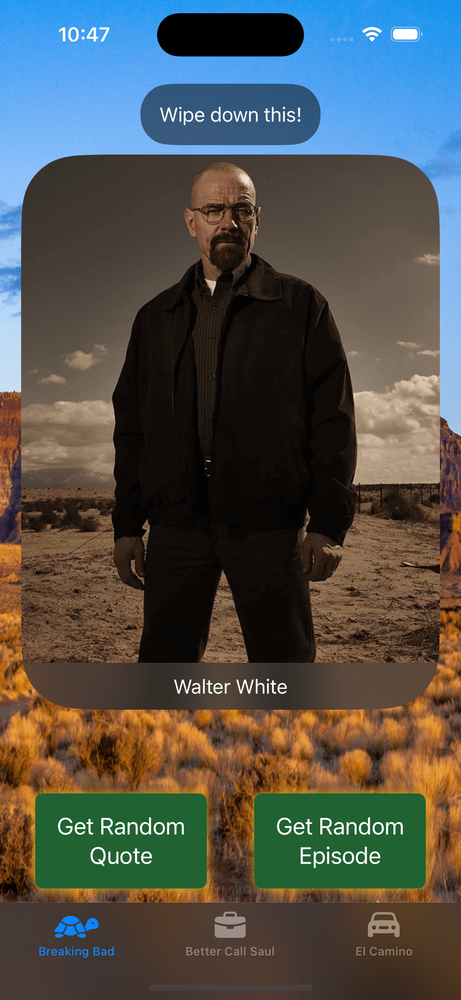
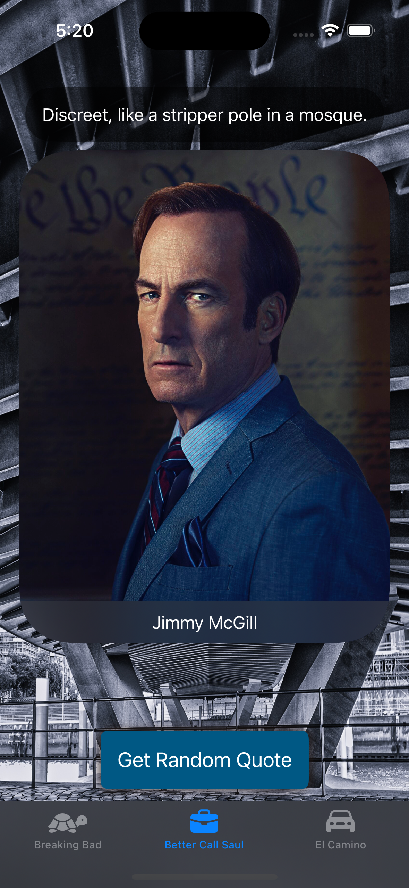
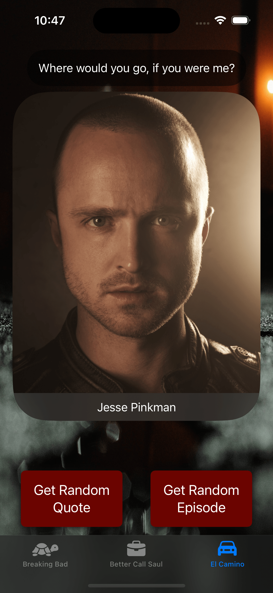
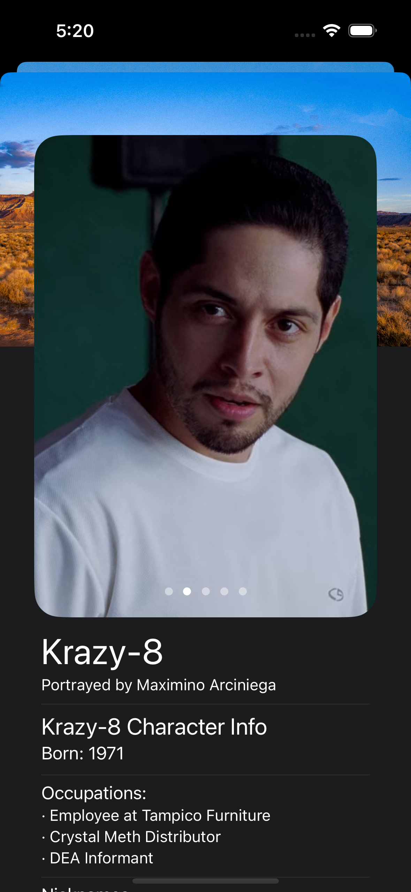
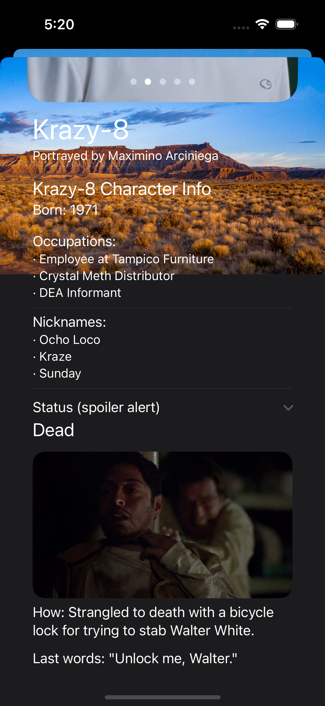

<div align="center">
  <h1>BBQuotes</h1>

  <p>
    <a href="https://developer.apple.com/swift/" target="_blank"></a>
    <a href="https://developer.apple.com/xcode/"></a>
    <a href="https://developer.apple.com/ios/"></a>
  </p>

  <h3>⚠️ SPOILER ALERT ⚠️</h3>
  <p>This app contains information about characters and events from Breaking Bad, Better Call Saul, and El Camino.</p>
  <p>...</p>
  <p>...</p>
  <p>...</p>
  <p>...</p>
  <p>...</p>
  <br>
  <div>
    &nbsp;&nbsp;&nbsp;
    &nbsp;&nbsp;&nbsp;
    
    <br><br>
    &nbsp;&nbsp;&nbsp;
    
  </div>

</div>

## Overview
BBQuotes is a SwiftUI application that showcases quotes from the Breaking Bad universe, including Breaking Bad, Better Call Saul, and El Camino. The app allows users to view random quotes, character information, and explore details about their favorite characters from these iconic TV series.

Based on the Udemy course [iOS 18, SwiftUI 6, & Swift 6: Build iOS Apps From Scratch](https://www.udemy.com/course/ios-15-app-development-with-swiftui-3-and-swift-5/), **with the following implementations by myself**:

- Integration of additional [packages](#packages) to extend capabilities and streamline development
- [Project structure](#project-structure) for better organization
- [Unit tests](https://github.com/uhcakip/BBQuotes/tree/master/BBQuotesTests) for API client and view models
- Enhanced API client with [generic `makeRequest` function](https://github.com/uhcakip/BBQuotes/blob/12f7134b8e4e49b191049caba347f5b3e2a7d0a8/BBQuotes/Clients/APIClient.swift#L38)
- Improved error handling with [custom `APIError` messages](https://github.com/uhcakip/BBQuotes/blob/12f7134b8e4e49b191049caba347f5b3e2a7d0a8/BBQuotes/Clients/APIClient.swift#L70)

## Features
- Fetch and display random quotes from Breaking Bad, Better Call Saul, and El Camino
- View detailed character information, including images, occupations, and status
- Toggle between different TV series
- Error handling and user feedback

## Demo


## Project Structure
```
.
├── BBQuotes
│   ├── BBQuotesApp.swift
│   ├── Clients
│   │   └── APIClient.swift
│   ├── Models
│   │   ├── Character.swift
│   │   ├── Death.swift
│   │   ├── Production.swift
│   │   └── Quote.swift
│   ├── Screens
│   │   ├── Character
│   │   │   └── Views
│   │   │       └── CharacterView.swift
│   │   ├── ContentView.swift
│   │   └── Quote
│   │       ├── ViewModels
│   │       │   └── QuoteViewModel.swift
│   │       └── Views
│   │           └── QuoteView.swift
│   └── Utils
│       └── MockData.swift
├── BBQuotesTests
│   ├── Clients
│   │   ├── APIClientIntegrationTests.swift
│   │   └── APIClientTests.swift
│   ├── Models
│   │   └── ProductionTests.swift
│   └── Screens
│       └── Quote
│           └── ViewModels
│               └── QuoteViewModelTests.swift
```

## Packages
This project uses Swift Package Manager (SPM) for dependency management. The following packages are included:

- [Inject](https://github.com/krzysztofzablocki/Inject) - Used for hot reloading during development
- [SwiftLint](https://github.com/realm/SwiftLint) - Used for code linting
- [SwiftFormat](https://github.com/nicklockwood/SwiftFormat) - Used for code formatting