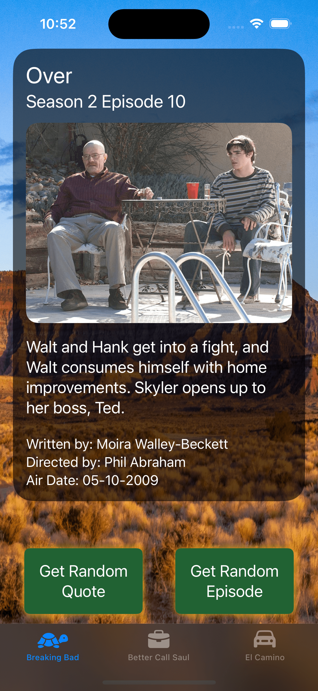
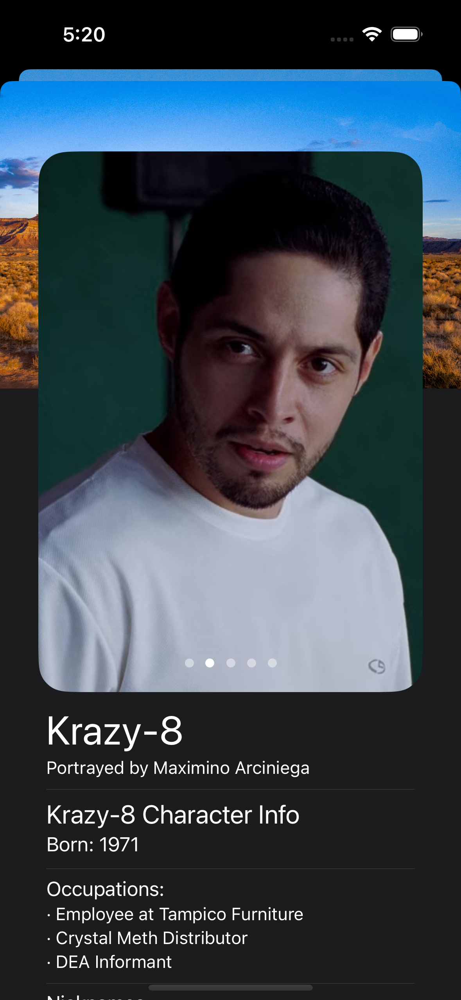
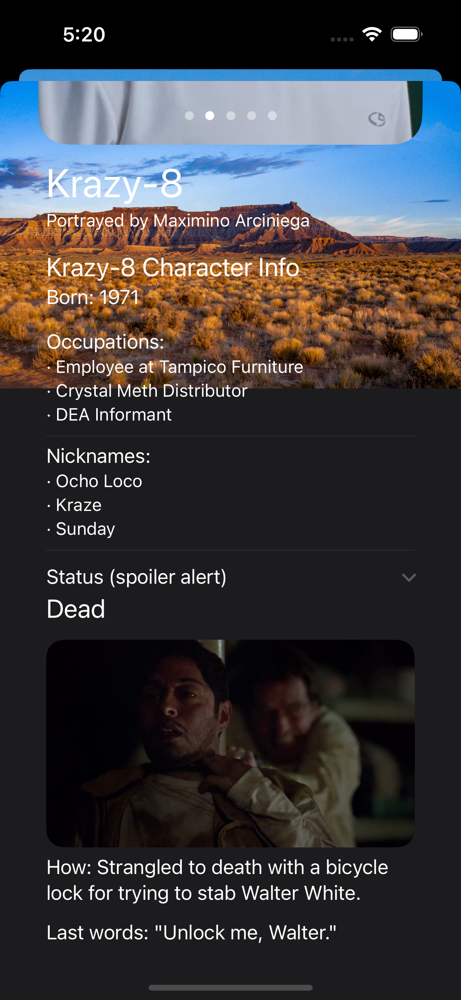

<div align="center">
  <h1>BBQuotes</h1>

  <p>
    <a href="https://developer.apple.com/swift/" target="_blank"></a>
    <a href="https://developer.apple.com/xcode/"></a>
    <a href="https://developer.apple.com/ios/"></a>
  </p>

  <h3>⚠️ SPOILER ALERT ⚠️</h3>
  <p>This app contains information about characters and events from Breaking Bad, Better Call Saul, and El Camino.</p>
  <p>...</p>
  <p>...</p>
  <p>...</p>
  <p>...</p>
  <p>...</p>
  <br>
  <div>
    &nbsp;&nbsp;&nbsp;
    &nbsp;&nbsp;&nbsp;
    
    <br><br>
    &nbsp;&nbsp;&nbsp;
    &nbsp;&nbsp;&nbsp;
    
  </div>

</div>

## Overview
BBQuotes is a SwiftUI application that showcases quotes and episodes from the Breaking Bad universe, including Breaking Bad, Better Call Saul, and El Camino. The app allows users to view random quotes, character information, explore details about their favorite characters, and get information about random episodes from these iconic TV series.

Based on the Udemy course [iOS 18, SwiftUI 6, & Swift 6: Build iOS Apps From Scratch](https://www.udemy.com/course/ios-15-app-development-with-swiftui-3-and-swift-5/).

### 💡 Custom Implementations
The following features and improvements were independently developed, extending beyond the course curriculum:

- Integration of additional [packages](#packages) to extend capabilities and streamline development
- [Project structure](#project-structure) for better organization
- [Unit tests](https://github.com/uhcakip/BBQuotes/tree/master/BBQuotesTests) for API client and view models
- Generic API client with [`makeRequest` function](https://github.com/uhcakip/BBQuotes/blob/12f7134b8e4e49b191049caba347f5b3e2a7d0a8/BBQuotes/Clients/APIClient.swift#L38)
- Custom error handling with [`APIError` messages](https://github.com/uhcakip/BBQuotes/blob/12f7134b8e4e49b191049caba347f5b3e2a7d0a8/BBQuotes/Clients/APIClient.swift#L70)
- Quote fetching feature on app launch
- Mock data in Preview Content for SwiftUI previews

A performance issue was discovered and fixed:

- [Redundant API calls were being made on app launch and tab switches, causing unnecessary network overhead](https://github.com/uhcakip/BBQuotes/pull/1)

## Features
- Fetch and display random quotes from Breaking Bad, Better Call Saul, and El Camino
- View detailed character information, including images, occupations, and status
- Fetch and display random episode information, including title, season, episode number, and synopsis
- Toggle between different TV series
- Error handling and user feedback

## Demo


## Project Structure
```
.
├── BBQuotes
│   ├── BBQuotesApp.swift
│   ├── Clients
│   │   └── APIClient.swift
│   ├── Models
│   │   ├── Character.swift
│   │   ├── Death.swift
│   │   ├── Episode.swift
│   │   ├── Production.swift
│   │   └── Quote.swift
│   ├── Preview Content
│   │   ├── MockData.swift
│   │   └── Preview Assets.xcassets
│   │       └── Contents.json
│   └── Screens
│       ├── Character
│       │   └── Views
│       │       └── CharacterView.swift
│       ├── ContentView.swift
│       └── QuoteEpisode
│           ├── Subviews
│           │   ├── EpisodeView.swift
│           │   └── QuoteView.swift
│           ├── ViewModels
│           │   └── QuoteEpisodeViewModel.swift
│           └── Views
│               └── QuoteEpisodeView.swift
└── BBQuotesTests
    ├── Clients
    │   ├── APIClientIntegrationTests.swift
    │   └── APIClientTests.swift
    ├── Models
    │   ├── EpisodeTests.swift
    │   └── ProductionTests.swift
    └── Screens
        └── QuoteEpisode
            └── ViewModels
                └── QuoteViewModelTests.swift
```

## Packages
This project uses Swift Package Manager (SPM) for dependency management. The following packages are included:

- [Inject](https://github.com/krzysztofzablocki/Inject) - Used for hot reloading during development
- [SwiftLint](https://github.com/realm/SwiftLint) - Used for code linting
- [SwiftFormat](https://github.com/nicklockwood/SwiftFormat) - Used for code formatting
